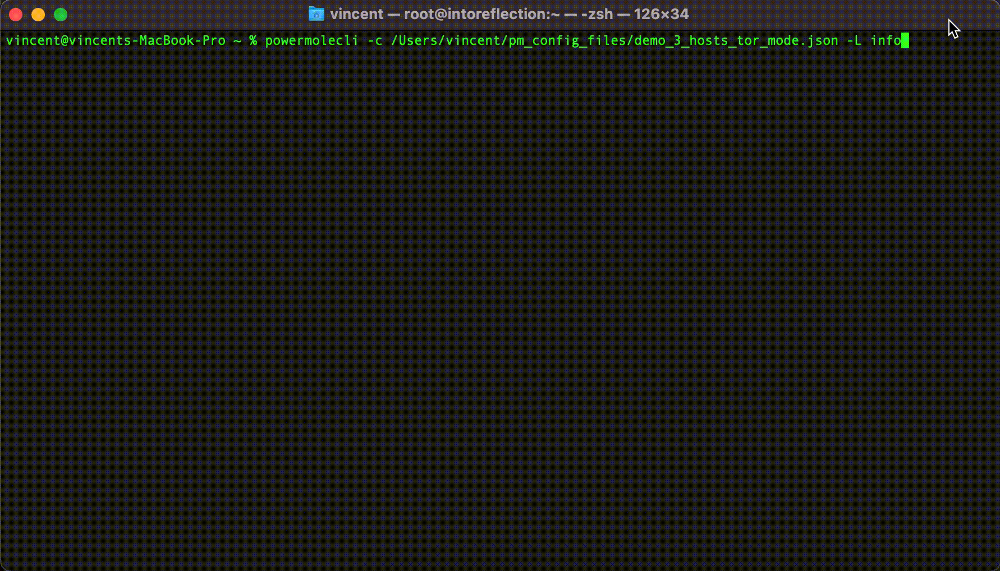
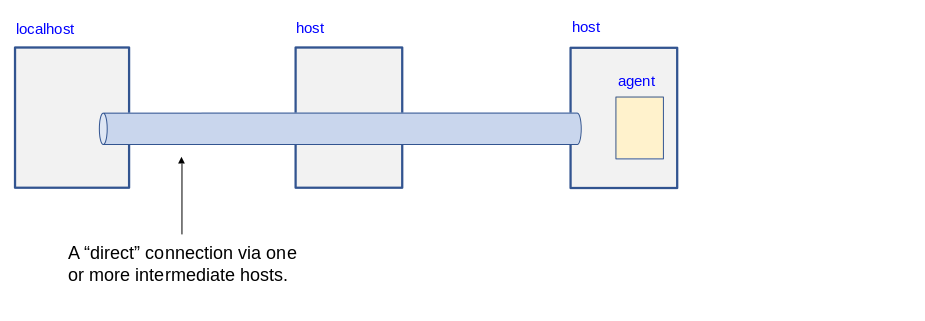
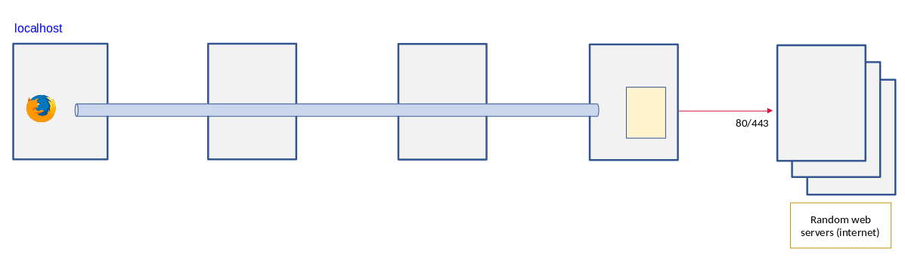

[comment]: <> (what cli does, treat it as the brochure of my car)

# powermole/cli

This program will let you perform port forwarding, redirect internet traffic, and transfer files to, and issue commands on,
a host without making a direct connection (ie. via one or more intermediate hosts), which would undoubtedly compromise your privacy.
This solution can only work when you or your peers own one or more hosts as this program communicates with SSH servers.
This program can be viewed as a multi-versatile wrapper around SSH with the ProxyJump directive enabled.
Powermole creates automatically a ssh/scp configuration file to enable key-based authentication with the intermediate hosts.

## Demo

### Running powermole with TOR mode enabled and COMMAND option selected.
In this mode, the target destination host acts as an exit node (in TOR terminology).
For the outside world, the web traffic seems to be originated from the last host.
Once the program states READY, a web browser of choice can be used to browse over the Internet.
In this demo, 2 gateways (intermediate hosts) are involved and COMMAND option is selected.

[comment]: <> (During the demo, highlight the words "local port 8080 will be listening for web traffic")



### Running powermole with FOR mode enabled and TRANSFER option selected.
In this mode, connections are forwarded to the target destination host, on which, for example, an email server (e.g. Postfix) is running.
When the user has set the application directive in the configuration file, a program of choice will be started automatically.
For example, Mozilla Thunderbird.
There are with 2 gateways (intermediate hosts) involved and TRANSFER option is selected.

[comment]: <> (During the demo, highlight the words "local ports ... will be forwarded")


## How it works

### Terminology
* **Tunnel** is an established connection from localhost to target destination host through intermediate hosts (called gateways).
* **Agent** is a python module running on the target destination host. It performs various functions.
* **Instructor** sends data and instructions to the *Agent* by utilizing a forwarded connection provided by *Tunnel*.

This cli package uses the lib package to create a Tunnel and models the specific Instructor to communicate with the Agent (on the target destination host).
The Agent communicates directly with the operating system of the host on which it resides.
The Agent is responsible to redirect internet traffic (TOR mode), put files (TRANSFER option), and issue commands (COMMAND option).
For port forwarding (FOR mode), the program simply relies on SSH itself. The Agent also responds to heartbeats send by localhost to check if connection is still intact.



For more details, including illustrations, please consult the [powermole library](https://github.com/yutanicorp/powermolelib) on GitHub.


## Requirements (software)

* Every host (except local host, ie. the _client_) needs a running SSH daemon.


## Requirements (functional)

* The client program only works on macOS and Linux (tested on macOS Big Sur, Red Hat, CentOS, Fedora).
* The intermediate hosts (gateways) must be Linux.
* The client and all hosts have Python >3.6 as their default interpreter.
* You need _at least_ 1 gateway.
* You have the associated SSH identification file (i.e. the private key) for these intermediaries.
* Due to security reasons, SSH password login is not supported.
* This program don't require root privileges on the client (*to be confirmed*).


## Installation

If you use the standard packet manager:

```
$ pip install powermolecli
```
or if you use pipx:
```
$ pipx install powermolecli
```


## Usage

Issue this command for help:

```
$ powermolecli --help

usage: powermolecli [-h] [--config-file CONFIG_FILE]
           [--log-level {debug,info,warning,error,critical}]

powermole allows you to connect to a target destination host via one or more intermediaries, offering a variety of modes (FOR, TOR, FILE, and INTERACTIVE) to perform a variety of tasks

optional arguments:
  -h, --help       show this help message and exit
  --config-file, -c CONFIG_FILE
                   The location of the config file
  --log-level, -L {debug,info,warning,error,critical}
                   Provide the log level. Defaults to info.
```

Issue this command to actually execute the program.

```
$ powermolecli --config-file ~/powermole.json
```


Use option "--log-level debug" to print every activity in the program.

```
$ powermolecli -c ~/powermole.json -l debug
```

The JSON file contains directives to enter one of the modes listed below:

* TOR mode
* FOR(warding) mode


In TOR mode, the target destination host acts as an exit node (in TOR terminology).



In FOR(warding) mode, connections are forwarded to the target destination host, on which, for example, an email server (e.g. Postfix) is running and a local email client want to connect to its listening ports.


## Configuration

#### To enable TOR mode

Edit the JSON document in the configuration file to incorporate the keywords **mode**, **gateways**, **destination**, and optionally **application**.
When **application** is specified, the program will start the application of choice once the Tunnel is ready.
In the example below, the program drills through 3 hosts and ends at host #4.
Hitting ctrl + c in terminal will dismantle the Tunnel (and abort the application)

```
    {
    "mode":         "TOR",
    "gateways":    [{"host_ip": "192.168.10.2",
                     "user": "root",
                     "identity_file": "/Users/vincent/.ssh/id_rsa_pl"},
                    {"host_ip": "192.168.10.3",
                     "user": "root",
                     "identity_file": "/Users/vincent/.ssh/id_rsa_cz"}],
    "destination": {"host_ip": "192.168.10.4",
                    "user": "root",
                    "identity_file": "/Users/vincent/.ssh/id_rsa_nl"},
    "application": {"binary_name": "firefox",
                    "binary_location": "/usr/bin/firefox"}
    }
```

#### To enable FOR(warding) mode

Edit the JSON document to incorporate the keywords **mode**, **gateways**, **destination**, **forwarders**, and optionally **application**.
When application is specified, then the program will start this application once the Tunnel is ready.
Hitting ctrl + c in terminal will dismantle the Tunnel (and abort the application)

```
    {
    "mode":         "FOR",
    "gateways":    [{"host_ip": "192.168.10.2",
                     "user": "root",
                     "identity_file": "/Users/vincent/.ssh/id_rsa_pl"},
                    {"host_ip": "192.168.10.3",
                     "user": "root",
                     "identity_file": "/Users/vincent/.ssh/id_rsa_cz"}],
    "destination": {"host_ip": "192.168.10.4",
                    "user": "root",
                    "identity_file": "/Users/vincent/.ssh/id_rsa_nl"},
    "forwarders": [{"local_port": 1587,
                    "remote_interface": "localhost",
                    "remote_port": 587},
                   {"local_port": 1995,
                    "remote_interface": "localhost",
                    "remote_port": 995}]
    }
```

## Errors

When running into issues, consider to start powermolecli with log-level 'debug' and/or
consult the log file in /tmp on destination host.


## Development Workflow

The workflow supports the following steps

 * lint
 * test
 * build
 * document
 * upload
 * graph

These actions are supported out of the box by the corresponding scripts under _CI/scripts directory with sane defaults based on best practices.
Sourcing setup_aliases.ps1 for windows powershell or setup_aliases.sh in bash on Mac or Linux will provide with handy aliases for the shell of all those commands prepended with an underscore.

The bootstrap script creates a .venv directory inside the project directory hosting the virtual environment. It uses pipenv for that.
It is called by all other scripts before they do anything. So one could simple start by calling _lint and that would set up everything before it tried to actually lint the project

Once the code is ready to be delivered the _tag script should be called accepting one of three arguments, patch, minor, major following the semantic versioning scheme.
So for the initial delivery one would call

    $ _tag --minor

which would bump the version of the project to 0.1.0 tag it in git and do a push and also ask for the change and automagically update HISTORY.rst with the version and the change provided.


So the full workflow after git is initialized is:

 * repeat as necessary (of course it could be test - code - lint)
   * code
   * lint
   * test
 * commit and push
 * develop more through the code-lint-test cycle
 * tag (with the appropriate argument)
 * build
 * upload (if you want to host your package in pypi)
 * document (of course this could be run at any point)


## Important Information

This template is based on pipenv. In order to be compatible with requirements.txt so the actual created package can be used by any part of the existing python ecosystem some hacks were needed.
So when building a package out of this **do not** simple call

    $ python setup.py sdist bdist_egg

## Documentation

* Documentation: https://powermolecli.readthedocs.org/en/latest


## Contributing

Please read [CONTRIBUTING.md](https://gist.github.com/PurpleBooth/b24679402957c63ec426) for details on our code of conduct, and the process for submitting pull requests to us.


## Authors

* **Vincent Schouten** - *Initial work* - [LINK](https://github.com/yutanicorp/powermolecli)

See also the list of [contributors](https://github.com/your/project/contributors) who participated in this project.


## License

This project is licensed under the MIT License - see the [LICENSE.md](LICENSE.md) file for details


## Acknowledgments

* Costas Tyfoxylos
* MisterDaneel (developer of pysoxy)

